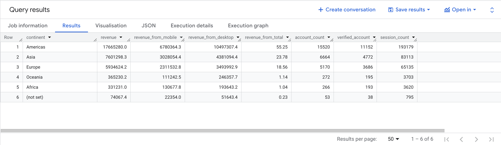

# Continent KPIs (BigQuery SQL)

This project builds a continent-level dataset to analyze:
- sessions (session_count)
- accounts (total and verified)
- revenue split by device (revenue, revenue_from_mobile, revenue_from_desktop)
- revenue share of total (revenue_from_total)

## Output grain
1 row per continent.

## Files
- `query.sql` — BigQuery SQL query
- `bq_results.png` — BigQuery results screenshot

